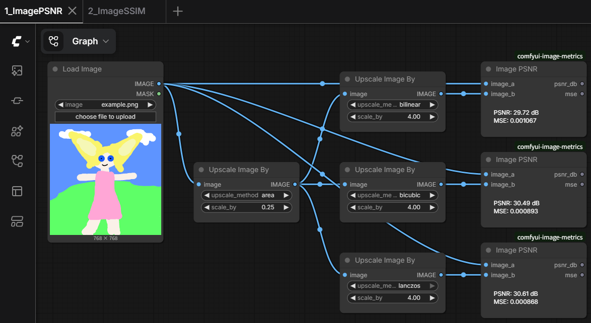
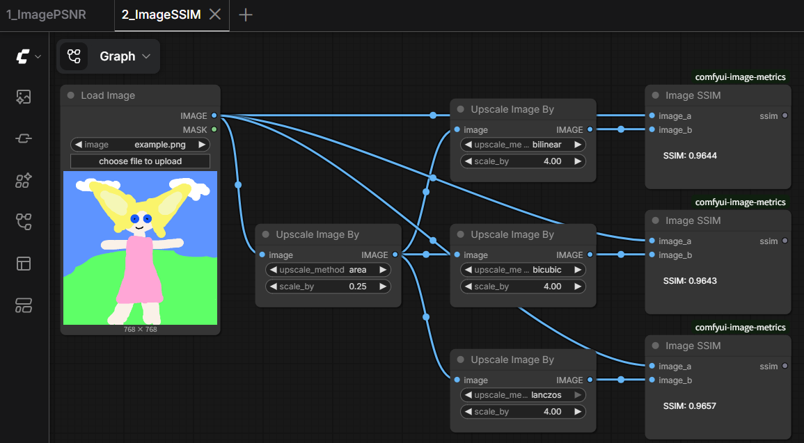

# ComfyUI-Image-Metrics

Full-reference image quality metrics for ComfyUI - PSNR, MAE, and SSIM between two images.

This package provides teaching nodes for quantifying how similar two images are, e.g. to score a reconstruction, an upscaling method, or a compression result against a reference - shown directly on the node and output as FLOAT for further use.

---

## Features

- **PSNR** (Peak Signal-to-Noise Ratio, dB) plus the underlying MSE it's computed from, for free
- **MAE** (Mean Absolute Error)
- **SSIM** (Structural Similarity Index), fixed to the standard Wang et al. 2004 parameters (11x11 Gaussian window, sigma=1.5, K1=0.01, K2=0.03) - no parameters exposed, since these defaults are what "SSIM" conventionally means in papers
- A batch is scored by computing the metric per image pair and averaging - the same convention benchmark papers use over a whole test set - rather than pooling every pixel from every image together
- Assumes the standard `0..1` IMAGE range; not offered for `SIGNED_IMAGE`, since PSNR's reference range has to match the data's true peak-to-peak range to mean anything

---

## Included Nodes

### Metrics

- Image PSNR
- Image MAE
- Image SSIM

---

## Sample Workflows

### Lesson 1. Image PSNR



Downscales an image and upscales it back with three different interpolation methods (bilinear, bicubic, lanczos), then scores each reconstruction against the original with `Image PSNR` - a quick way to compare resampling methods numerically.

### Lesson 2. Image SSIM



Same comparison as Lesson 1, scored with `Image SSIM` instead - useful for seeing where PSNR and SSIM agree or disagree on which method looks "better".

---

## Installation

Clone this repository into your ComfyUI custom_nodes folder.

```text
ComfyUI/
└── custom_nodes/
    └── comfyui-image-metrics/
```

Restart ComfyUI after installation. No extra Python dependencies are required.

---

## License

See the repository license file for details.